# 离线数仓和即席查询组件介绍 <!-- omit in toc -->

## 目录 <!-- omit in toc -->

- [1. 大数据介绍](#1-大数据介绍)
- [2. HDFS - 存储](#2-hdfs---存储)
  - [2.1. HDFS介绍](#21-hdfs介绍)
  - [2.2. HDFS基本操作（查看、上传、下载）](#22-hdfs基本操作查看上传下载)
  - [2.3. HDFS WebUI界面展示](#23-hdfs-webui界面展示)
- [3. MapReduce - 计算(模型)](#3-mapreduce---计算模型)
  - [3.1. MapReduce介绍](#31-mapreduce介绍)
  - [3.2. MapReduce原理](#32-mapreduce原理)
- [4. YARN - 资源调度](#4-yarn---资源调度)
  - [4.1. YARN介绍](#41-yarn介绍)
  - [4.2. YARN WebUI界面展示](#42-yarn-webui界面展示)
- [5. Hive - 离线计算](#5-hive---离线计算)
  - [5.1. Hive介绍](#51-hive介绍)
  - [5.2. Hive基本操作（建表、查询、外部表）](#52-hive基本操作建表查询外部表)
  - [5.3. Hive(Tez) WebUI界面展示](#53-hivetez-webui界面展示)
- [6. Presto/Trino - 即席查询](#6-prestotrino---即席查询)
  - [6.1. Presto介绍](#61-presto介绍)
  - [6.2. Presto基本操作（查询）](#62-presto基本操作查询)
  - [6.3. Presto WebUI界面展示](#63-presto-webui界面展示)

# 1. 大数据介绍

> 了解一下历史，因为如今大数据已经常态化。

大数据的5个V：

1. Volume（数据量）：指大数据的规模庞大，涉及海量数据的处理和存储。
2. Velocity（速度）：描述数据产生的速度快以及需要及时处理和分析的紧迫性。
3. Variety（多样性）：涵盖多种类型的数据，包括结构化、半结构化和非结构化数据。
4. Veracity（准确性）：涉及数据的质量和可靠性，即数据的准确性和可信度。
5. Value（价值）：强调从大量数据中提取有价值的信息和知识的能力。

观看视频[0:00,2:00]：[大数据的5V介绍.mp4](https://www.youtube.com/watch?v=bAyrObl7TYE)

Hadoop历史：[Apache Hadoop](https://en.wikipedia.org/wiki/Apache_Hadoop)

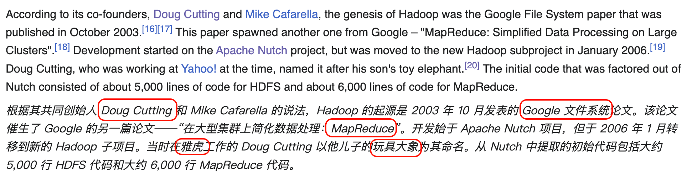

# 2. HDFS - 存储

> 著名的Google论文: [gfs-sosp2003](https://static.googleusercontent.com/media/research.google.com/en//archive/gfs-sosp2003.pdf)  

## 2.1. HDFS介绍

- 概述
  - HDFS（Hadoop Distributed File System）是Apache Hadoop生态系统中的核心组件，设计用于在**通用硬件**上存储和管理大规模数据集。
- 主从架构
  - NameNode：主节点，负责管理文件系统的元数据，包括文件和目录的层次结构、文件块的映射等。
  - DataNode：从节点，负责存储实际的数据块并执行数据块的读写操作。
- **数据存储**
  - **分块(Shard/Partiton)**：HDFS将文件分割成固定大小的数据块，默认大小为128MB。
  - **副本（Replica）**：每个数据块会在多个DataNode上复制，通常副本数为3，以确保数据的高可用性和容错性。
- 适用场景
  - 适合需要处理大规模数据集的批量作业，如日志处理、数据分析等。
  - 不适合低延迟数据访问和频繁更新的数据。
- 特点
  - 高吞吐量：适合批量处理大规模数据集，提供高带宽的数据访问。
  - 高容错性：通过数据冗余和自动故障恢复机制，确保在节点故障时数据的可用性。
  - 高可靠性：保证数据的持久存储和完整性。
  - 高扩展性：可以轻松添加新的节点来扩展存储容量和计算能力。

架构图：

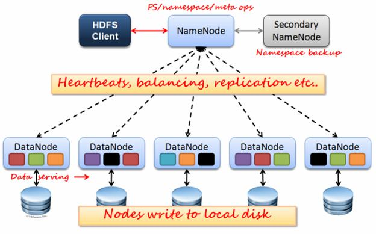

分块+副本：

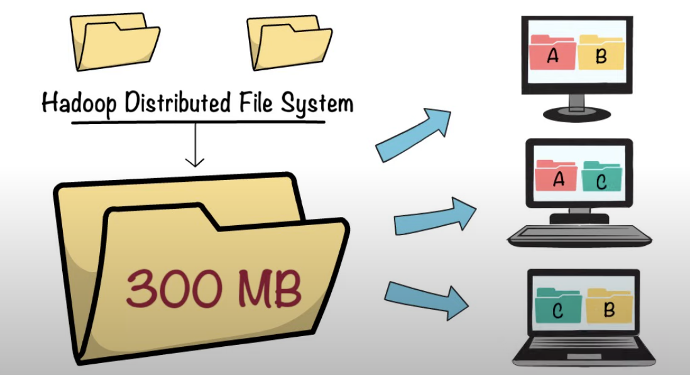

观看视频[2:00,2:43]：[HDFS介绍.mp4](https://www.youtube.com/watch?v=bAyrObl7TYE&t=120s)

## 2.2. HDFS基本操作（查看、上传、下载）

```sh
# 启动演示集群: 
docker-compose up -d

# 演示`hdfs`命令基本操作
# 进入容器
docker-compose exec -it namenode bash

# ls子命令
hdfs dfs -ls /
# Hive的默认hdfs路径
hdfs dfs -ls /user/hive/

# 新建一个csv文件
cat > ./data.csv <<\EOF
id,name,age
1,A,10
2,B,11
3,C,20
4,D,21
5,E,30
6,F,31
7,G,40
8,H,41
EOF

# 上传到hdfs
## 新建一个hdfs目录
hdfs dfs -mkdir -p /data/csv/
## 上传文件
hdfs dfs -put ./data.csv /data/csv/

# 检查文件
## 先删除本地文件
rm -f ./data.csv
## 读取文件
hdfs dfs -ls /data/csv/
hdfs dfs -cat /data/csv/data.csv 

# 从hdfs下载文件
hdfs dfs -get /data/csv/data.csv
cat ./data.csv
```

## 2.3. HDFS WebUI界面展示

- 本地HDFS WebUI：<http://localhost:9870/>

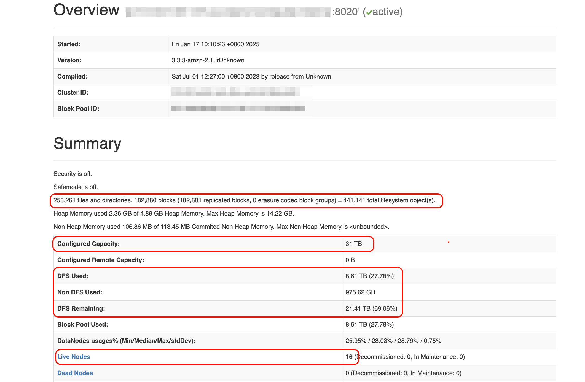

# 3. MapReduce - 计算(模型)

## 3.1. MapReduce介绍

> 著名的Google论文: [mapreduce-osdi04.pdf](https://static.googleusercontent.com/media/research.google.com/en//archive/mapreduce-osdi04.pdf)

MapReduce 是一种分布式并行计算框架，其核心思想是“分而治之”，通过将复杂任务拆解为多个子任务并行处理，最终汇总结果。

1. **分而治之的并行模型**  
   - **Map 阶段**：输入数据被分割为多个独立的数据块（Split），由多个 **Map Task** 并行处理。每个 Map Task 将输入键值对（如文本行）转换为中间键值对（如 `<单词, 1>`）。
   - **Reduce 阶段**：中间结果按键分组后，由多个 **Reduce Task** 并行聚合（如求和、去重），生成最终结果。  
2. **容错与自动恢复**  
  若某个 Map/Reduce Task 失败，系统自动重新调度到其他节点执行。

## 3.2. MapReduce原理

WordCount demo:

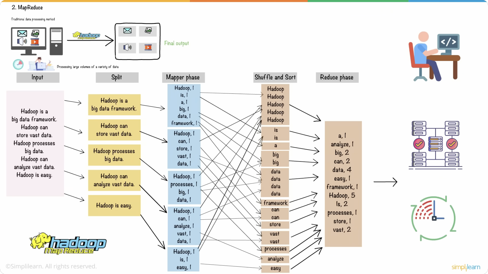

运行demo：

```sh
# 计算圆周率
hadoop jar /opt/hadoop-3.2.1/share/hadoop/mapreduce/hadoop-mapreduce-examples-3.2.1.jar pi 3 1000
# 单词计数
hadoop jar /opt/hadoop-3.2.1/share/hadoop/mapreduce/hadoop-mapreduce-examples-3.2.1.jar wordcount /data/csv/data.csv /tmp/wc_output/
```

# 4. YARN - 资源调度

## 4.1. YARN介绍

Hadoop YARN（Yet Another Resource Negotiator）是 Hadoop 2.0 引入的通用资源管理与作业调度框架，其核心目标是将资源管理（如 CPU、内存）与计算框架（如 MapReduce、Spark、Flink）解耦，从而支持多租户、高扩展性和灵活的计算模型。（备注：资源管理框架逐渐被**Kubernetes**代替）

YARN 采用 **主从架构**，由以下核心组件构成：  

1. **ResourceManager（RM）**
   - **全局资源管理者**：负责集群资源的统一分配与调度。  
   - **核心功能**：  
     - 接收客户端提交的作业请求，启动对应的 **ApplicationMaster（AM）**。  
     - 监控 **NodeManager（NM）** 的状态，处理节点故障。  
2. **NodeManager（NM）**
   - **节点级资源代理**：管理单个物理节点上的资源与任务执行。  
   - **核心职责**：  
     - 启动和监控 **Container**（资源分配的基本单元，包含 CPU、内存等）。  
     - 定期向 RM 汇报节点资源状态（如可用内存、运行中的 Container 数量）。  
3. **ApplicationMaster（AM）**
   - **作业生命周期管理者**：每个应用程序（如 MapReduce、Spark）独立启动一个 AM。  
   - **核心职责**：  
     - 向 RM 申请资源（如请求 10 个 Container，每个 2 核 4GB）。  
     - 与 NM 协作启动任务，监控任务状态，处理失败任务的重试。  
4. **Container**  
   - **资源封装单元**：代表集群中的计算资源（如内存、CPU），由 NM 启动和管理，用于运行具体任务（如 Map Task、Reduce Task）。  

架构图：

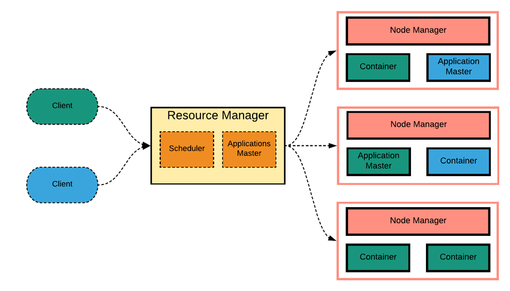

## 4.2. YARN WebUI界面展示

- 本地YARN界面展示：<http://localhost:8088/>

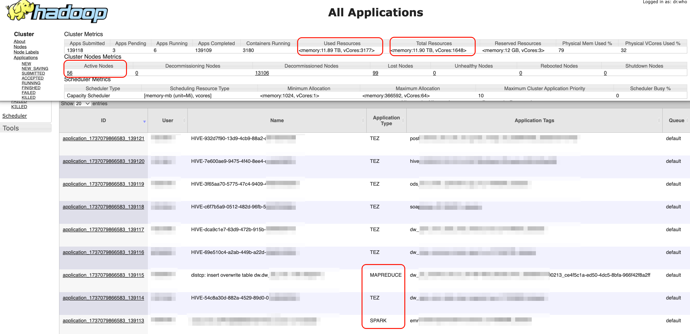

# 5. Hive - 离线计算

## 5.1. Hive介绍

Hive 是由 Facebook 开源的基于 Hadoop 的数据仓库工具，主要用于海量**结构化数据**的离线统计分析。其核心功能是将 **结构化数据文件映射为数据库表**，并通过类 SQL 语言（HQL）进行查询，底层将 HQL 转换为 MapReduce、Spark 或 Tez 任务执行。Hive 的数据存储在 HDFS 中，依赖 YARN 进行资源调度。

结构图：

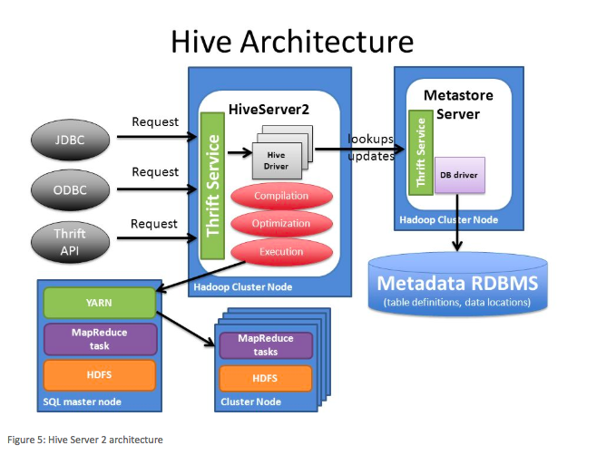

## 5.2. Hive基本操作（建表、查询、外部表）

通过beeline命令连接（JDBC）：

```sh
# 进入容器
docker-compose exec -it hive-server bash
# 连接Hive（JDBC）
beeline -u jdbc:hive2://localhost:10000 -n hive
```

Hive SQL演示：

```sql
-- # 查看schemas
show schemas;
-- # 新建schema
create schema test;
-- # 切换schema
use test;

-- # 新建表
create table test.t_internal (
    id bigint,
    name string
) stored as parquet;
-- # 插入样例数据
insert into test.t_internal values (1, 'A'), (2, 'B'), (3, 'C');

-- # 查看
select * from test.t_internal limit 10;
select count(1) as cnt from test.t_internal;


-- # Hive外部表
drop table if exists test.t_csv_external;
create external table test.t_csv_external (
    id bigint,
    name string,
    age bigint
)
stored as textfile
location '/data/csv/'
tblproperties (
    "skip.header.count"="1",
    "skip.header.line.count"="1",
    "serialization.null.format"="",
    "field.delim"=",",
    "escape.delim"="\"",
    "quote.delim"="\""
);

-- # 查看
select * from test.t_csv_external limit 10;
select count(1) as cnt from test.t_csv_external;
```

## 5.3. Hive(Tez) WebUI界面展示

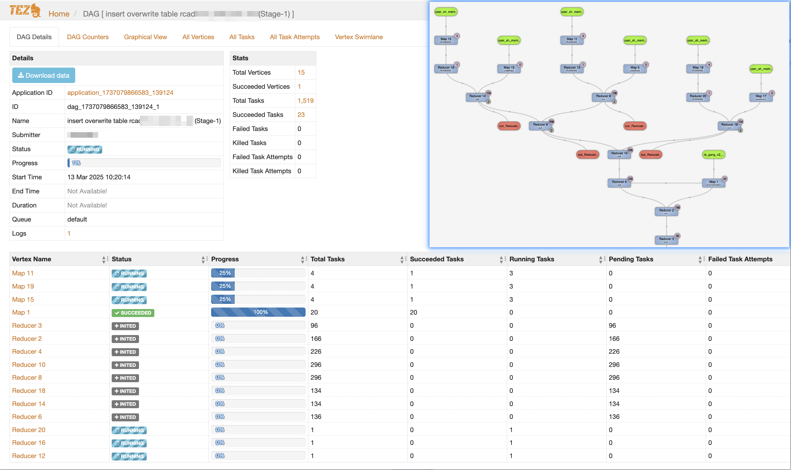

# 6. Presto/Trino - 即席查询

> 关于Presto/Trino分支说明：
>
> - PrestoDB：Facebook 维护的原生分支，持续迭代核心功能；
> - ​Trino​（原 PrestoSQL）：社区主导的分支，更注重企业级特性；
>
> 下面都以“Presto”名称来代表介绍。

## 6.1. Presto介绍

Presto 是一款由 Facebook 开源的 **分布式 SQL 查询引擎**，专为跨异构数据源的交互式分析设计，支持从 **GB 到 PB 级** 数据的低延迟查询。其核心优势在于能够直接查询多种数据源（如 Hive、MySQL、Cassandra 等）而无需数据迁移，并通过内存计算优化性能。

Presto 采用 **主从架构**，由以下核心组件构成：  

1. **Coordinator（协调器）**  
   - 负责接收 SQL 查询请求，解析并生成执行计划。  
   - 将任务拆分为多个可并行执行的 **Stage** 和 **Task**，调度至 Worker 节点。  
2. **Worker（工作节点）**  
   - 执行具体任务，包括数据拉取（通过 Connector）和计算（如聚合、JOIN）。  
   - 节点间通过 **流水线并行** 传输中间结果，减少磁盘 I/O。  
3. **Connector（连接器）**  
   - 类似数据库驱动，支持对接 **Hive、MySQL、Elasticsearch** 等异构数据源。  
   - 通过 **Catalog** 定义数据源映射（如 `hive.properties` 配置 Hive 元数据存储地址）。  

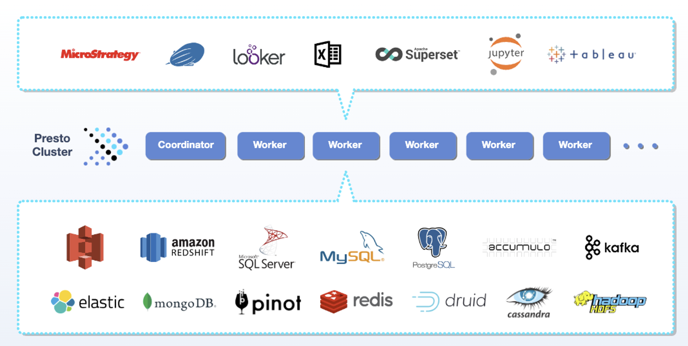

## 6.2. Presto基本操作（查询）

```sql
-- # 查询Hive中有什么表
show tables from hive.test;

-- # 查询Hive表数据
select * from hive.test.t_internal limit 10;
select * from hive.test.t_csv_external limit 10;
select count(1) as cnt from hive.test.t_csv_external limit 10;
```

## 6.3. Presto WebUI界面展示

- 本地Presto界面展示：<http://localhost:18010/>

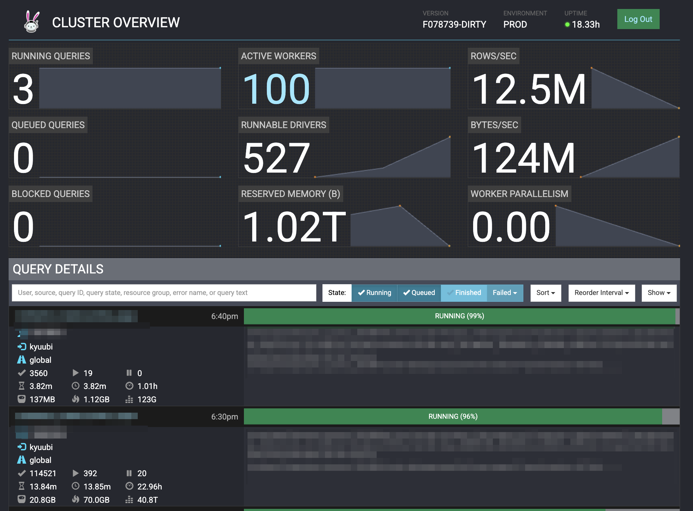
